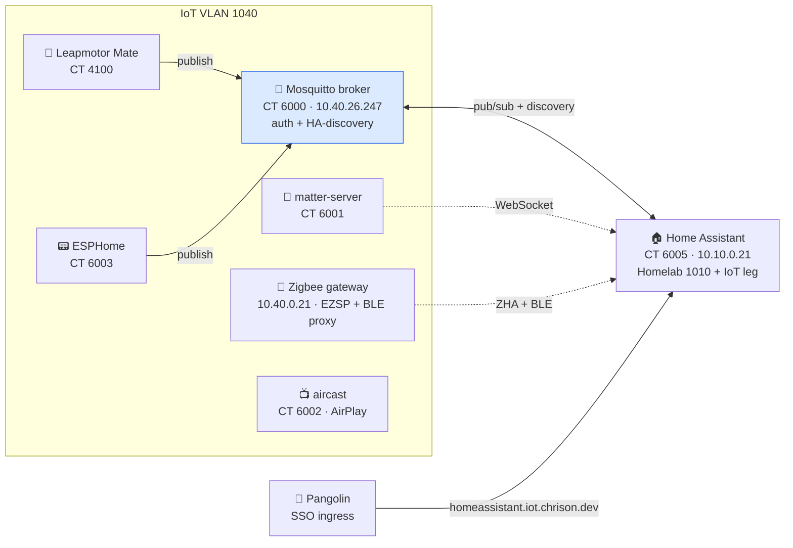

# SmartHome

[](https://github.com/Chrison-Homelab/Homelab.Stacks.SmartHome/actions/workflows/validate.yml)
[](https://github.com/Fallout-build/Fallout)
[](https://github.com/Chrison-Homelab/Homelab)

The home-automation / IoT **support layer** — the infrastructure that feeds
Home Assistant. Built to grow: MQTT is the first member; zigbee2mqtt, node-red,
esphome, zwave-js-ui, frigate, etc. drop into this same stack + broker as needed.

A [`Homelab.Stacks.*`](https://github.com/Chrison-Homelab/Homelab) submodule
(mounts at `stacks/SmartHome`), converged by the Fallout engine.



## Members

CTID block **6000–6099** for LXC members (declared in [`stack.yaml`](stack.yaml)).
Home Assistant moved **into** the block on 2026-08-09 (CT 6005) — the retired HAOS VM 2000 and
Leapmotor Mate (CT 4100) are the remaining out-of-block entries, both superseded.

| ID | Member | Kind | Net | Role | Status |
|----|--------|------|-----|------|--------|
| 6000 | [mqtt](mqtt.lxc.yaml) | LXC (Mosquitto) | IoT 1040 · `10.40.26.247` | The message bus | ✅ live |
| 6001 | [matter-server](matter-server.lxc.yaml) | Docker host | IoT 1040 · `10.40.62.181` | Matter/Thread controller (ex-HA add-on) | ✅ live |
| 6002 | [aircast](aircast.lxc.yaml) | Docker host | IoT 1040 · `10.40.147.133` | Chromecast→AirPlay bridge (ex-HA add-on) | ✅ live |
| 6003 | [esphome](esphome.lxc.yaml) | LXC (native) | IoT 1040 · `10.40.60.203` (reserved) | ESP firmware dashboard/builder (ex-HA add-on) | ✅ live (#251) |
| 6004 | [podman-host](podman-host.lxc.yaml) | LXC (rootless Podman) | IoT 1040 | Quadlet host — runs Leapmotor Mate (ADR-0009) | ✅ live |
| 6005 | [homeassistant](homeassistant.lxc.yaml) | Docker host (HA Container) | Homelab 1010 **+** IoT 1040 | **The hub** | ✅ **live** — replaced VM 2000 |
| 4100 | [leapmotor-mate](leapmotor-mate.lxc.yaml) | Docker host | IoT 1040 · `10.40.169.225` (reserved) | Leapmotor C10 companion → publishes to the broker | 🔎 **adopted in-place, out-of-block** |
| 2000 | [homeassistant](homeassistant.vm.yaml) | VM (HAOS) | legacy `192.168.179.102` | Former hub | ⛔ **retired** — stopped, `onboot: false`, kept as rollback |

## Extracted-from-HA members (matter-server, aircast)

Both ran as HAOS add-ons; now standalone. Same images the add-ons wrap, layered on a
thin Docker host (`app: docker`), CT-local state, internal-only.

- **matter-server** (`ghcr.io/home-assistant-libs/python-matter-server`): HA drives it
  over WebSocket — point HA's Matter integration at `ws://10.40.62.181:5580/ws`.
  ⚠️ **Matter needs IPv6.** VLAN 1040 currently sends no Router Advertisements, so device
  commissioning will fail (`chip … Network is unreachable`) until **IPv6 is enabled on the
  IoT VLAN** (UniFi → network 1040 → IPv6/RA). The WS↔HA path works over IPv4 regardless.
  Its community-scripts native installer is disabled upstream (python-matter-server archived
  2026-06-23), hence the Docker-host route.
- **aircast** (AirConnect, `1activegeek/airconnect`): `network_mode: host` so mDNS/RTP reach
  the LAN; discovers Chromecasts and re-advertises them as AirPlay. No HA dependency.

> **Create-path fix (2026-07-17):** community-scripts' `build.func` gained a host
> "LXC-stack upgrade available?" gate that prompts via `read </dev/tty` — fatal to
> non-interactive SSH creates once a `pve-container`/`lxc-pve` update is pending. The engine
> now passes `DISABLE_UPDATE=yes PHS_SILENT=1` (build.func's own unattended escapes) on every
> create. See `Infrastructure/engine/Converge/CommunityScriptsCreator.cs`.

## The MQTT broker (CT 6000)

Native community-scripts install (`app: mqtt` → `ct/mqtt.sh` → Eclipse Mosquitto
2.x). The installer ships a hardened `default.conf` (`allow_anonymous false`,
`password_file /etc/mosquitto/passwd`, `listener 1883`) but **no** password file —
so the broker rejects everyone until users are added.

### Securing the broker (post-deploy)

```bash
# on CT 6000 — one user per client, then lock the file + restart
mosquitto_passwd -b -c /etc/mosquitto/passwd leapmotor     '<pw>'
mosquitto_passwd -b    /etc/mosquitto/passwd homeassistant '<pw>'
chown mosquitto:mosquitto /etc/mosquitto/passwd && chmod 600 /etc/mosquitto/passwd
systemctl restart mosquitto
```

Passwords are generated and stored in **Bitwarden** (items `mqtt · leapmotor`,
`mqtt · homeassistant`). Anonymous is off; a wrong password gets `not authorised`.
The broker's IP is **DHCP-reserved** (`10.40.26.247`) so clients have a stable address.

## Clients & wiring

- **Leapmotor Mate (CT 4100)** — an IoT service, so it lives on **VLAN 1040**
  alongside the broker (moved off Homelab 1010 to avoid an inter-VLAN hop; the
  IoT VLAN is firewalled off from 1010). Enable in Mate → Settings → MQTT:
  broker `10.40.26.247:1883`, user `leapmotor`, discovery **on** (prefix
  `homeassistant`). Mate publishes state to `leapmotor/<VIN>/…` and HA-discovery
  configs to `homeassistant/sensor/…`. See [`leapmotor-mate/`](leapmotor-mate/README.md)
  for the app itself — the dedicated-account requirement + first-run cert wizard.
- **Home Assistant (VM 2000)** — reaches the broker over its legacy NIC (legacy →
  1040 routes fine). **Manual step:** Settings → Devices & Services → Add
  Integration → **MQTT** → broker `10.40.26.247`, port `1883`, user
  `homeassistant` + password. HA then auto-discovers every Mate entity.

> HA also has an **idle IoT NIC** (`net1`, tag 1040, `link_down=1`) intended for
> future L2 chatter with IoT devices. It's **not needed for MQTT** and is left
> untouched — enabling it is a deliberate HAOS-side change, not done here.

## Home Assistant — CT 6005 (the hub)

[`homeassistant.lxc.yaml`](homeassistant.lxc.yaml) — **HA Container** via community-scripts
`ct/homeassistant.sh` (Docker on Debian 13 running `ghcr.io/home-assistant/home-assistant:stable`
with `--net=host`). Migrated from the HAOS VM on **2026-08-09** (Homelab#250).

| | |
|---|---|
| Internal | `homeassistant.iot.chrison.internal` and `homeassistant.homelab.chrison.internal` → `10.10.0.21` |
| External | `homeassistant.iot.chrison.dev` and `homeassistant.lab.chrison.dev` — Pangolin SSO |
| Sizing | 4 cores / 4096 MB / 32 GB — **not** the script's 2/2048/16 default, which is the exact shape that timed out HA's bootstrap on the VM (Homelab#382) |
| NICs | net0 Homelab 1010 `10.10.0.21` (default route) · net1 IoT 1040 `10.40.0.22` (device-facing, **no** default route) |

**Updates are the community-scripts `update_script`** (docker pull + recreate), deliberately
outside converge — that maintained upgrade path is the reason for using it. Converge owns the CT
(size, NICs, lifecycle) and nothing inside it. No Supervisor, so **no add-on store and no
HA-managed backup**.

### Built from scratch, not restored

Nothing was restored from VM 2000. It had 75 config entries of which only 19 loaded, and 530 of its
701 entities were unavailable — mostly ghosts from the previous rental. CT 6005 runs 21 entries,
all loaded. Discovery-based integrations repopulated themselves: MQTT came back with the same **81**
entities without intervention.

### Zigbee did NOT need re-pairing

The plan assumed a full re-pair. It was wrong, and the correction is worth keeping: both `zha`
entries on VM 2000 being `not_loaded` with 0 entities meant **nothing was connected to the
coordinator**, not that the network was lost. ZHA's config flow offered `reuse_settings` — only
shown when the radio's NVRAM holds an existing network — so CT 6005 **adopted** the live network
(`pan_id F881`, channel 25). Sleepy battery devices still have to transmit once before ZHA
re-interviews them, but no device was re-paired.

**Probe the coordinator before assuming a Zigbee network is gone.** `not_loaded` is a client-side
symptom.

### Bluetooth comes from the Zigbee gateway

The Xiaomi/BTHome sensors arrive over the gateway's ESPHome **`bluetooth_proxy`**, not a USB dongle
— which is what makes running HA in an LXC viable at all. That same firmware also carries a legacy
`ble_monitor` bridge that floods the log; see
[`docs/devices/tube-zb-gw-efr32/`](docs/devices/tube-zb-gw-efr32/README.md) before touching the
gateway's Bluetooth switch or the ESPHome `allow_service_calls` option.

### The retired VM

[`homeassistant.vm.yaml`](homeassistant.vm.yaml) is now `spec.manage: retired` with
`onboot: false`, and VM 2000 is **stopped, not destroyed** — it is the rollback (`qm start 2000`).
`retired` is load-bearing: converge refuses to recreate it even when named in `--only`, which a tag
and a comment do not (Homelab#362). ⚠️ **Never run both** — they share the MQTT broker, the Matter
server and the Zigbee coordinator.

### What a rebuild does NOT restore

The shape captures the container. It does **not** capture HA's `.storage`: config entries and their
credentials, the floor/area registry, the ZHA device database, integration options, or anything
installed through HACS. That gap is tracked in #27, which is **blocked** on deciding how secrets
are handled — `.storage` holds live credentials and the Zigbee network key.

## Build & release (this repo)

This stack owns its own Fallout pipeline. `./build.sh` **here** validates and packages —
it does not deploy; see [Deploying](#deploying) for that.

```bash
./build.sh                              # ValidateShapes — the same engine `validate` the superproject runs
./build.sh Bundle                       # + dist/smarthome-<version>.tar.gz and a manifest
./build.sh Release --dry-run            # + resolve the version, without publishing
./build.sh Bundle --skip ValidateShapes # macOS/Windows: the portable validator is linux-x64 only
```

Fallout 10.4 is public on nuget.org, so nothing here needs a package-feed PAT. The one
credential is **`SCHEMA_RO_PAT`** (`contents:read` on the private superproject), used to
download the portable validator from its `schema-v1` release.

**Releases are the deploy unit.** A merge to `main` that changes a shape or a service asset
cuts a GitHub Release: the bundle plus a `MANIFEST.md` recording the commit, the build time,
and every member's ID and lifecycle. A deploy resolves the tag to that bundle, so what was
validated is what ships. Docs-only merges don't release — the artifact would be identical.

Versions are **SemVer derived from the labels on the PRs merged since the last tag**:

| Label on any merged PR | Bump | What it means here |
|---|---|---|
| `breaking-change` | major | a member's `ctid`, or anything that forces recreating a guest |
| `enhancement` | minor | a new member or capability |
| anything else | patch | fixes, dependencies, housekeeping |

So the label set at PR-creation time decides the version; a PR merged without one is a patch
bump and lands under "Other Changes". See [`.github/release.yml`](.github/release.yml).

## Deploying

Converge runs **from the superproject**, which owns the engine and the cluster credentials
(Proxmox API + SSH to the nodes, on the self-hosted runner):

```bash
# in Chrison-Homelab/Homelab
./build.sh Preview --stack SmartHome   # dry-run (read-only)
./build.sh Deploy  --stack SmartHome   # apply — creates/updates LXC members
```

> The retired HA VM (2000) carries `manage: retired`, so `Deploy` never writes or recreates it —
> naming it in `--only` does not override that (#325, Homelab#362).

## Files

| Path | Purpose |
|------|---------|
| `stack.yaml` | Stack defaults + CTID block (6000–6099), IoT VLAN 1040. |
| `mqtt.lxc.yaml` | Mosquitto broker — CT 6000. |
| `matter-server.lxc.yaml` · `aircast.lxc.yaml` · `esphome.lxc.yaml` | The ex-HA-add-on members (CT 6001–6003). |
| `leapmotor-mate.lxc.yaml` | Adopted Docker-host LXC (CT 4100, out-of-block) — the C10 companion. |
| `leapmotor-mate/` | Its compose + certs + `.env.example` + service README. |
| `homeassistant.lxc.yaml` | **Home Assistant — CT 6005**, the hub. Dual-homed, converge-managed. |
| `homeassistant.vm.yaml` | The retired HAOS VM (2000) — stopped, kept as the rollback. |
| `build/Build.cs` · `build.sh` · `build.ps1` | This stack's Fallout pipeline — validate, bundle, release. |
| `.github/release.yml` | Label taxonomy. Drives the generated notes **and** the version bump. |
| `.github/workflows/build.yml` · `release.yml` | PR gate, and the `Production` release. |
