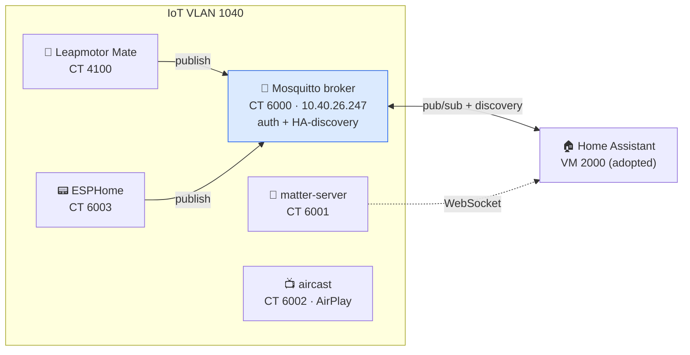

# SmartHome

[](https://github.com/Chrison-Homelab/Homelab.Stacks.SmartHome/actions/workflows/validate.yml)
[](https://github.com/Fallout-build/Fallout)
[](https://github.com/Chrison-Homelab/Homelab)

The home-automation / IoT **support layer** — the infrastructure that feeds
Home Assistant. Built to grow: MQTT is the first member; zigbee2mqtt, node-red,
esphome, zwave-js-ui, frigate, etc. drop into this same stack + broker as needed.

A [`Homelab.Stacks.*`](https://github.com/Chrison-Homelab/Homelab) submodule
(mounts at `stacks/SmartHome`), converged by the Fallout engine.



## Members

CTID block **6000–6099** for LXC members (declared in [`stack.yaml`](stack.yaml)).
Home Assistant (VMID 2000) and Leapmotor Mate (CT 4100) are **adopted, out-of-block
members** kept at their live IDs — see below.

| ID | Member | Kind | Net | Role | Status |
|----|--------|------|-----|------|--------|
| 6000 | [mqtt](mqtt.lxc.yaml) | LXC (Mosquitto) | IoT 1040 · `10.40.26.247` | The message bus | ✅ live |
| 6001 | [matter-server](matter-server.lxc.yaml) | Docker host | IoT 1040 · `10.40.62.181` | Matter/Thread controller (ex-HA add-on) | ✅ live |
| 6002 | [aircast](aircast.lxc.yaml) | Docker host | IoT 1040 · `10.40.147.133` | Chromecast→AirPlay bridge (ex-HA add-on) | ✅ live |
| 6003 | [esphome](esphome.lxc.yaml) | LXC (native) | IoT 1040 · `10.40.60.203` (reserved) | ESP firmware dashboard/builder (ex-HA add-on) | ✅ live (#251) |
| 4100 | [leapmotor-mate](leapmotor-mate.lxc.yaml) | Docker host | IoT 1040 · `10.40.169.225` (reserved) | Leapmotor C10 companion → publishes to the broker | 🔎 **adopted in-place, out-of-block** |
| 2000 | [homeassistant](homeassistant.vm.yaml) | VM (HAOS) | legacy `192.168.179.102` (+ idle IoT NIC) | The hub / consumer | 🔎 **adopted, describe-only** |

## Extracted-from-HA members (matter-server, aircast)

Both ran as HAOS add-ons; now standalone. Same images the add-ons wrap, layered on a
thin Docker host (`app: docker`), CT-local state, internal-only.

- **matter-server** (`ghcr.io/home-assistant-libs/python-matter-server`): HA drives it
  over WebSocket — point HA's Matter integration at `ws://10.40.62.181:5580/ws`.
  ⚠️ **Matter needs IPv6.** VLAN 1040 currently sends no Router Advertisements, so device
  commissioning will fail (`chip … Network is unreachable`) until **IPv6 is enabled on the
  IoT VLAN** (UniFi → network 1040 → IPv6/RA). The WS↔HA path works over IPv4 regardless.
  Its community-scripts native installer is disabled upstream (python-matter-server archived
  2026-06-23), hence the Docker-host route.
- **aircast** (AirConnect, `1activegeek/airconnect`): `network_mode: host` so mDNS/RTP reach
  the LAN; discovers Chromecasts and re-advertises them as AirPlay. No HA dependency.

> **Create-path fix (2026-07-17):** community-scripts' `build.func` gained a host
> "LXC-stack upgrade available?" gate that prompts via `read </dev/tty` — fatal to
> non-interactive SSH creates once a `pve-container`/`lxc-pve` update is pending. The engine
> now passes `DISABLE_UPDATE=yes PHS_SILENT=1` (build.func's own unattended escapes) on every
> create. See `Infrastructure/engine/Converge/CommunityScriptsCreator.cs`.

## The MQTT broker (CT 6000)

Native community-scripts install (`app: mqtt` → `ct/mqtt.sh` → Eclipse Mosquitto
2.x). The installer ships a hardened `default.conf` (`allow_anonymous false`,
`password_file /etc/mosquitto/passwd`, `listener 1883`) but **no** password file —
so the broker rejects everyone until users are added.

### Securing the broker (post-deploy)

```bash
# on CT 6000 — one user per client, then lock the file + restart
mosquitto_passwd -b -c /etc/mosquitto/passwd leapmotor     '<pw>'
mosquitto_passwd -b    /etc/mosquitto/passwd homeassistant '<pw>'
chown mosquitto:mosquitto /etc/mosquitto/passwd && chmod 600 /etc/mosquitto/passwd
systemctl restart mosquitto
```

Passwords are generated and stored in **Bitwarden** (items `mqtt · leapmotor`,
`mqtt · homeassistant`). Anonymous is off; a wrong password gets `not authorised`.
The broker's IP is **DHCP-reserved** (`10.40.26.247`) so clients have a stable address.

## Clients & wiring

- **Leapmotor Mate (CT 4100)** — an IoT service, so it lives on **VLAN 1040**
  alongside the broker (moved off Homelab 1010 to avoid an inter-VLAN hop; the
  IoT VLAN is firewalled off from 1010). Enable in Mate → Settings → MQTT:
  broker `10.40.26.247:1883`, user `leapmotor`, discovery **on** (prefix
  `homeassistant`). Mate publishes state to `leapmotor/<VIN>/…` and HA-discovery
  configs to `homeassistant/sensor/…`. See [`leapmotor-mate/`](leapmotor-mate/README.md)
  for the app itself — the dedicated-account requirement + first-run cert wizard.
- **Home Assistant (VM 2000)** — reaches the broker over its legacy NIC (legacy →
  1040 routes fine). **Manual step:** Settings → Devices & Services → Add
  Integration → **MQTT** → broker `10.40.26.247`, port `1883`, user
  `homeassistant` + password. HA then auto-discovers every Mate entity.

> HA also has an **idle IoT NIC** (`net1`, tag 1040, `link_down=1`) intended for
> future L2 chatter with IoT devices. It's **not needed for MQTT** and is left
> untouched — enabling it is a deliberate HAOS-side change, not done here.

## Home Assistant — adopted (describe-only)

[`homeassistant.vm.yaml`](homeassistant.vm.yaml) captures the live HAOS VM (VMID
2000) so the stack is **reproducible**, but it is **not converged/applied** — HA
is a stateful box we don't routinely reconcile, and multi-NIC converge isn't wired
yet. `Preview` is read-only; the only drift it reports is cosmetic (Proxmox tags +
an `agent` formatting no-op — no disk/net/memory changes).

**Redeploy-from-scratch seam:** HAOS ships as a disk image, so a fresh rebuild
seeds the VM with community-scripts `vm/haos-vm.sh` (downloads + imports the HAOS
qcow2); this shape documents the sizing/firmware to match, and HA's own
config/state restores from an **HA backup** (not from this shape).

## Deploying

```bash
./build.sh Preview --stack SmartHome   # dry-run (read-only)
./build.sh Deploy  --stack SmartHome   # apply — creates/updates LXC members
```

> ⚠️ Until a `managed:false` exclude flag exists, `Deploy` includes the adopted
> HA VM. Its plan is cosmetic-only today (tags/agent), but treat HA as
> **describe-only** and don't apply it deliberately.

## Files

| Path | Purpose |
|------|---------|
| `stack.yaml` | Stack defaults + CTID block (6000–6099), IoT VLAN 1040. |
| `mqtt.lxc.yaml` | Mosquitto broker — CT 6000. |
| `matter-server.lxc.yaml` · `aircast.lxc.yaml` · `esphome.lxc.yaml` | The ex-HA-add-on members (CT 6001–6003). |
| `leapmotor-mate.lxc.yaml` | Adopted Docker-host LXC (CT 4100, out-of-block) — the C10 companion. |
| `leapmotor-mate/` | Its compose + certs + `.env.example` + service README. |
| `homeassistant.vm.yaml` | Adopted HAOS VM (2000) — describe-only. |
