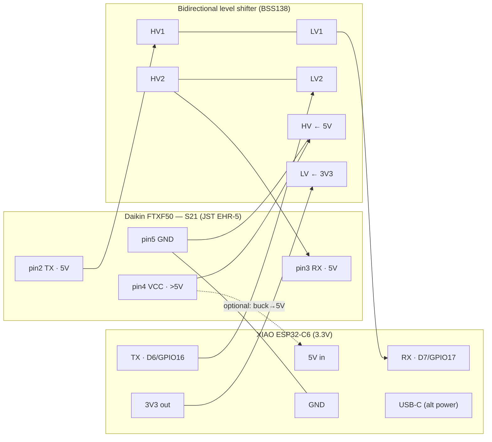

# Hardware — Daikin S21 ↔ XIAO ESP32-C6

Wiring, bill of materials, and the "do we need a custom PCB?" decision for the
[Daikin FTXF50 S21 integration](../README.md).

## The circuit in plain terms

The Daikin **S21** port is a **2400 baud, 8E2 UART at 5 V logic**, plus a `>5 V`
power pin. The **XIAO ESP32-C6** is a **3.3 V** part. So the whole board is just:

1. a **bidirectional level shifter** on the two UART lines (5 V ↔ 3.3 V), and
2. **power** for the C6 — either its own USB-C, or the S21 `>5 V` pin through a
   small buck regulator.

That's it. No custom silicon, no exotic parts.

## S21 connector pinout (JST `EHR-5`)

Verify against the [component README](https://github.com/joshbenner/esphome-daikin-s21)
and the [Faikout wiring wiki](https://codeberg.org/RevK/ESP32-Faikout/wiki/Wiring)
**before** you plug in — pin-1 orientation varies by how you hold the plug.

| S21 pin | Function | Level | Goes to (via level shifter) |
|:------:|----------|:-----:|------------------------------|
| 1 | Unused | — | — |
| 2 | **TX** (AC → us) | 5 V | shifter HV → LV → C6 **RX** |
| 3 | **RX** (us → AC) | 5 V | C6 **TX** → shifter LV → HV |
| 4 | **VCC** | **`>5 V`** | *optional* buck → C6 5V pin (measure first!) |
| 5 | **GND** | 0 V | common ground (shifter GND + C6 GND) |

> ⚠️ **Measure pin 4 before using it.** The component docs explicitly warn the S21
> power pin is `>5 V` and current-limited — regulate to 5 V (buck) if you power the
> C6 from it, or just power the C6 from USB-C and leave pin 4 unconnected.

## Wiring diagram

- **TX↔RX crossover:** S21 **TX** (pin 2) → C6 **RX**; C6 **TX** → S21 **RX**
  (pin 3). Cross them, don't wire straight-through.
- **Level-shifter rails:** `HV` = 5 V (from S21 VCC, *or* a bench 5 V), `LV` = the
  C6's `3V3` output. Common all grounds.
- **Pins on the C6:** the config uses the XIAO's labelled **TX = D6 (GPIO16)** and
  **RX = D7 (GPIO17)** — any two free GPIOs work; keep them matched to the
  [`esphome-daikin-downstairs.yaml.example`](../esphome-daikin-downstairs.yaml.example).

## Bill of materials

The C6 is already on hand (see [`esp-fleet.md`](../../../esp-fleet.md) — 2× XIAO
ESP32-C6). Everything else is a few dollars.

| # | Part | Qty | Notes | Rough NZD |
|---|------|-----|-------|-----------|
| 1 | **XIAO ESP32-C6** | 1 | Already owned (ESP fleet). Wi-Fi 6 + tiny → fits inside the AC's cavity. | — |
| 2 | **Bidirectional logic level converter** (BSS138, 4-channel module) | 1 | Only 2 channels used (TX/RX). The ubiquitous "5V↔3V3" breakout. | ~2 |
| 3 | **JST EHR-5 socket + pre-crimped pigtail** (2.5 mm pitch, 5-pin) | 1 | Mates the S21 header. Buy a pigtail to avoid crimping; keep the OEM Wi-Fi port free. | ~3 |
| 4 | **Buck converter** (MP1584EN mini, adj.) *(optional)* | 1 | Only if powering the C6 from S21 pin 4; set to 5.0 V. Skip if USB-C powering. | ~2 |
| 5 | **USB-C cable + 5 V adapter** *(alt to #4)* | 1 | Simplest reliable power if there's a socket near the unit. | ~5 |
| 6 | Dupont/silicone hookup wire, heatshrink, small enclosure/kapton | — | Tidy + isolate inside the unit. | ~3 |

**Two power options — pick one:**
- **A (simplest):** power the C6 by **USB-C**, leave S21 pin 4 unconnected. Use only
  if there's a nearby outlet.
- **B (self-contained):** tap S21 **pin 4 → buck (→5.0 V) → C6 5V pin**. Measure pin 4
  first; the buck protects against the `>5 V`/over-voltage.

## Do we need Gerber / Fritzing files? — **decision: no (for now)**

**We are not spinning a custom PCB or committing Gerbers.** Reasoning:

- It's a **2-channel level shifter + a connector**. A **BSS138 breakout on perfboard**
  (or even inline heatshrink) does the whole job — a custom board buys nothing here.
- A fab run is **≥5 boards, paid, ~2-week lead** (JLCPCB/PCBWay). Overkill for two ACs.
- Un-validated Gerbers committed "to be safe" are a **trap** — they look authoritative
  and get ordered without a real design review. The text schema above is the honest,
  reviewable source of truth.

**If we later *do* want a proper board** (e.g. building several, or wanting the neat
tucked-in look), **don't design one from scratch — use RevK's open hardware:** the
[Faikin/Faikout](https://codeberg.org/RevK/ESP32-Faikout) project already publishes a
purpose-built S21 PCB (level-shift + regulator + S21 header, FET RX-invert) as **open
hardware with Gerbers/KiCad**. Order/adapt that. This folder is where a
`daikin-s21-c6-hat/` KiCad project would go **if** we ever justify it — with a real
schematic review, not before.

## Gotchas

- **Logic inversion.** Most ESPHome `daikin_s21` builds work with a plain
  bidirectional shifter and a normally-configured UART. RevK's board instead inverts
  the ESP **RX** via a FET. If the component won't sync/handshake, suspect inversion:
  try a FET inverter on RX (or the ESP32 UART `invert` option) as
  [Faikout's wiring](https://codeberg.org/RevK/ESP32-Faikout/wiki/Wiring) shows.
- **Baud/format is fixed:** **2400 8E2** — not the usual 8N1. It's already set in the YAML.
- **Ground everything together:** S21 GND, level-shifter GND, and C6 GND must be common,
  or the UART levels float and you get garbage.
- **Fit:** the C6 + a small shifter tuck into the FTXF's right-side electrical cavity;
  route the pigtail so the front grille still closes.
</content>
